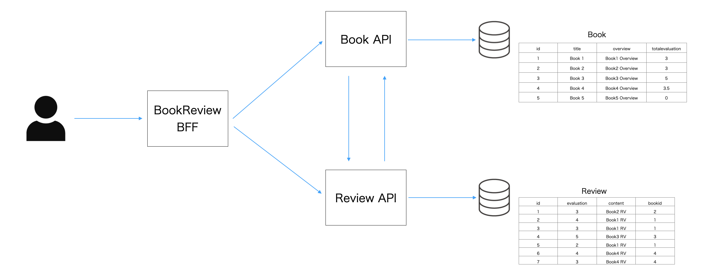

# BookReview MSA
BookReview MSA is Spring Boot Web Application that provides a service for posting book information and reviews.
This application consist of 3 compornents.

- BookReview BFF
- Book API
- Review API



## Quick Start
Run BookReview using `docker compose` and in-memory database H2.

```
# docker compose up -d  
```

Access `http://127.0.0.1:8080`. 